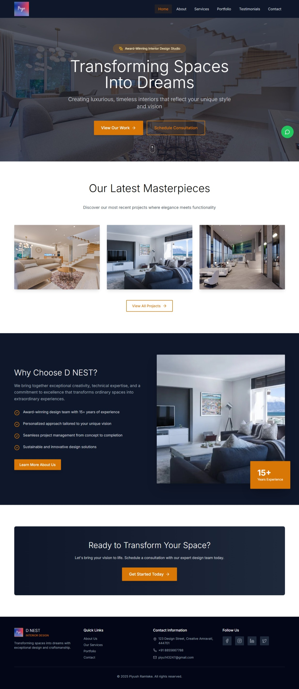

# 🏠 DNEST Interior Design Studio By Piyu

**Blending creativity with precision.**

DNEST Interior Design Studio crafts modular, minimal, and functional spaces.  
We specialize in personalized residential and commercial interiors — guided by structured workflows, ergonomic design, and visual harmony.

## ✨ Our Focus
- Modular & Minimal Designs  
- Personalized Interiors (Home & Office)  
- Ergonomic Planning  
- Visual Clarity & Functionality  

## 🖼️ Gallery

*(Make sure these image files are in a folder named `images/` inside your project.)*

## 📞 Contact
🌐 Website:[dnestdesigns.com](https://www.linkedin.com/in/piyush-ramteke-24-mylife).
📧 Email: piyu.143247@gmail.com  
📍 Location: [Amravati, India]

---

> *Crafting immersive environments that inspire and endure.*
