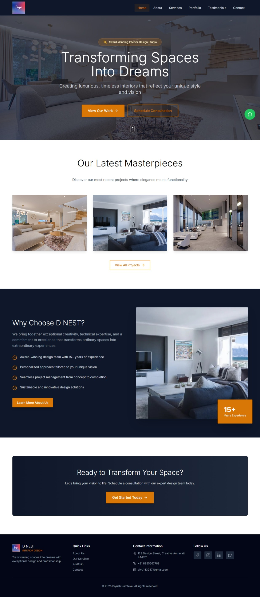

# 🏠 D NEST Interior Design Studio

> *Transforming Spaces Into Dreams*

A modern interior design website built with **React**, **TypeScript**, **Tailwind CSS**, and **Vite**.



---

## 🚀 Quick Start

### Prerequisites
- [Node.js](https://nodejs.org/) (v18 or higher)
- [VS Code](https://code.visualstudio.com/)

### Run in VS Code

1. **Clone the repository**
   ```bash
   git clone https://github.com/Piyu242005/Interior-design-Website-.git
   ```

2. **Open in VS Code**
   ```bash
   cd Interior-design-Website-
   code .
   ```

3. **Install dependencies**
   ```bash
   npm install
   ```

4. **Start the development server**
   ```bash
   npm run dev
   ```

5. **Open in browser**  
   Visit 👉 [http://localhost:5173](http://localhost:5173)

---

## 📁 Project Structure

```
src/
├── components/     # Reusable UI components
├── pages/          # Page components (Home, About, Services, etc.)
├── lib/            # Utilities (Supabase client)
├── App.tsx         # Main app component
└── main.tsx        # Entry point
```

---

## 🛠️ Available Scripts

| Command | Description |
|---------|-------------|
| `npm run dev` | Start dev server |
| `npm run build` | Build for production |
| `npm run preview` | Preview production build |
| `npm run lint` | Run ESLint |

---

## ✨ Features

- 🎨 Modern, responsive design
- 📱 Mobile-friendly
- ⚡ Fast with Vite
- 🎯 TypeScript for type safety
- 💅 Tailwind CSS styling
- 💬 WhatsApp chat widget

---

## 📄 Pages

- **Home** - Landing page with hero section
- **About** - Company information
- **Services** - Interior design services
- **Portfolio** - Project showcase
- **Listings** - Property listings
- **Contact** - Contact form

---

## 👤 Author

**Piyush Ramteke**  
📧 piyu.143247@gmail.com  
🔗 [LinkedIn](https://www.linkedin.com/in/piyush-ramteke-24-mylife)  
📍 Amravati, India

---

## 📜 License

This project is open source and available under the MIT License.
