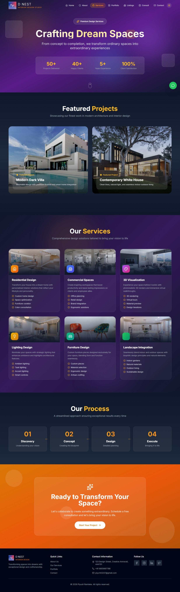
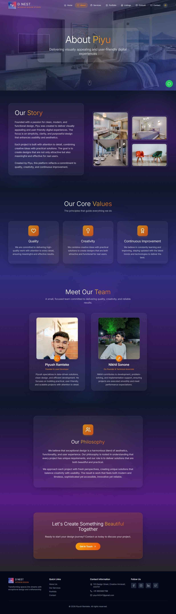
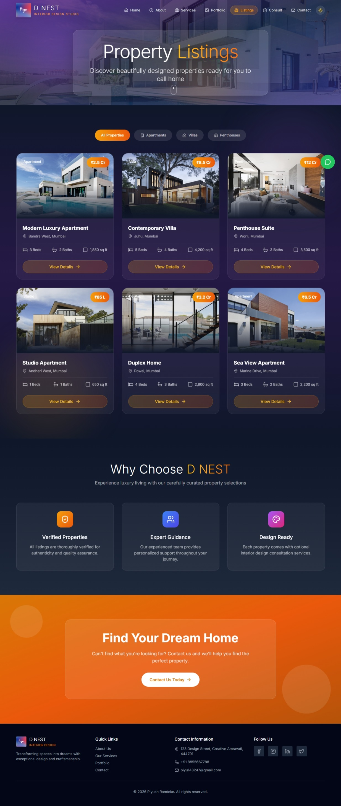
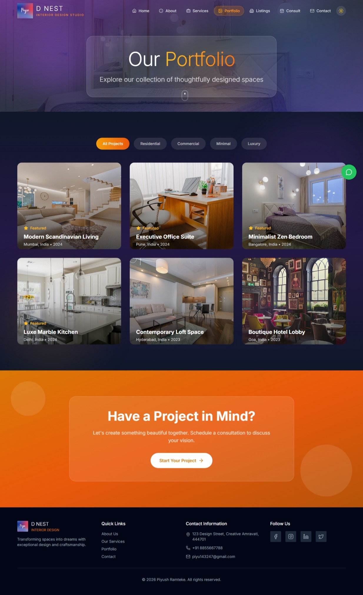
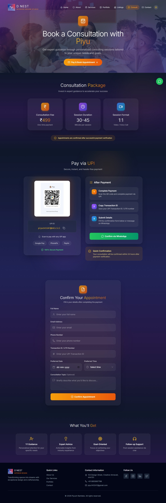
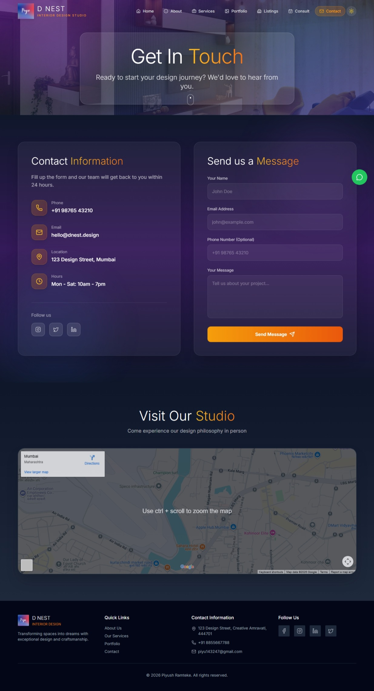

<div align="center">
  
  <h1>🏠 D NEST Interior Design Studio</h1>
  
  <p>
    <strong>Transforming Spaces Into Dreams</strong><br>
    <em>A modern, responsive, and visually rich portfolio website designed for interior design services and professional consulting.</em>
  </p>

  <p>
    
    
    
    
  </p>
</div>

<br />

## 🌟 About The Project

**D NEST / Piyu Interior Design & Consulting Website** is an elegantly crafted platform highlighting core services, featured portfolio listings, client testimonials, and a secure UPI-based consultation booking system. Built for performance and aesthetics, it delivers a premium user experience across all devices.

### ✨ Key Features

- **🎨 Modern Aesthetics:** Premium UI crafted with responsive Tailwind CSS.
- **⚡ Super Fast:** Lightweight and highly performant Flask backend.
- **📱 Fully Responsive:** Flawless experience on desktop, tablet, and mobile displays.
- **💳 Seamless Bookings:** Consultation appointment system bundled with a secure UPI/QR payment integration.
- **💬 Instant Support:** Integrated WhatsApp floating chat widget for immediate inquiries.
- **🖼️ Interactive Gallery:** Dynamic, filterable portfolio grid and property listings.

---

## 🚀 Quick Start Guide

Follow these simple steps to set up the project locally on your machine.

### Prerequisites

Ensure you have the following installed on your system:
- [Python](https://python.org/) (v3.9 or higher)
- [pip](https://pip.pypa.io/)

### Installation

1. **Clone the repository**
   ```bash
   git clone https://github.com/Piyu242005/Interior-design-Website-.git
   cd Interior-design-Website-
   ```

2. **Navigate to the Flask application folder**
   ```bash
   cd flask_app
   ```

3. **Set up a virtual environment** *(Highly Recommended)*
   ```bash
   python -m venv venv
   
   # For Windows
   .\venv\Scripts\activate
   # For macOS/Linux
   source venv/bin/activate
   ```

4. **Install required dependencies**
   ```bash
   pip install -r requirements.txt
   ```

5. **Fire up the development server!**
   ```bash
   python app.py
   ```

   Visit 👉 **[http://localhost:5000](http://localhost:5000)** in your browser to view the app!

---

## 📸 Guided Tour & Screenshots

*Click the dropdowns below to explore the website's stunning sections.*

<details>
<summary><strong>🏠 Home Page</strong></summary>

Beautiful hero section introducing the studio.

</details>

<details>
<summary><strong>🛋️ Services Overview</strong></summary>

Showcases core interior design services with a premium UI and modern layout.

</details>

<details>
<summary><strong>👤 About Us</strong></summary>

Discover the creator's vision and elegant design philosophy.

</details>

<details>
<summary><strong>🧾 Offerings & Listings</strong></summary>

Neatly categorized interior projects and exclusive offerings.

</details>

<details>
<summary><strong>🖼 Exquisite Portfolio</strong></summary>

Highlights featured projects with immersive images, exact locations, and completion details.

</details>

<details>
<summary><strong>💬 Consultations & UPI Booking</strong></summary>

Users can effortlessly book personalized consultations and safely complete payments via a secure UPI QR-based system.

</details>

<details>
<summary><strong>📞 Contact Section</strong></summary>

Streamlined inquiry form and straightforward contact details for perfectly smooth communication.

</details>

<details>
<summary><strong>💳 Payment Gateway Preview</strong></summary>

A sneak peek at the seamless payment mechanism.

</details>

<details>
<summary><strong>📸 Extra Project Preview (Niku)</strong></summary>

Additional glimpse into the curated designs.

</details>

<details>
<summary><strong>🏢 Alternate Project View</strong></summary>

More stunning aesthetics and architecture details.

</details>

---

## 📁 Project Architecture

```text
flask_app/
├── app.py                 # Core Flask application script
├── supabase_client.py     # Supabase DB integration client (optional)
├── requirements.txt       # Python package dependencies
├── static/
│   └── images/            # Static assets and media
└── templates/
    ├── base.html          # Global Jinja2 layout template
    ├── home.html          # Landing page template
    ├── about.html         # About the studio template
    ├── services.html      # Service catalog template
    ├── portfolio.html     # Project gallery template
    ├── listings.html      # Available properties/packages
    └── contact.html       # Contact form & details template
```

---

## 🛠️ CLI Commands

| Command | Action |
|---------|---------|
| `python app.py` | Starts the local development server |
| `pip install -r requirements.txt` | Installs system dependencies |
| `gunicorn -w 4 app:app` | Runs application in Production mode (for deployment) |

---

## 🔌 API Reference

| Endpoint | Method | Description |
|----------|--------|-------------|
| `/api/portfolio` | `GET` | Retrieve the entire list of portfolio items |
| `/api/portfolio/featured` | `GET` | Retrieve only highlighted featured items |
| `/api/contact` | `POST` | Process and store new contact inquiries |
| `/api/listings` | `GET` | Retrieve active property & package listings |

---

## 👤 Meet the Author

**Piyush Ramteke**  
<a href="mailto:piyu.143247@gmail.com"></a>
<a href="https://www.linkedin.com/in/piyush-ramteke-24-mylife"></a>  
📍 Amravati, India

---

## 📜 License

Distributed under the **MIT License**. Feel free to use, modify, and build upon this open-source project.
